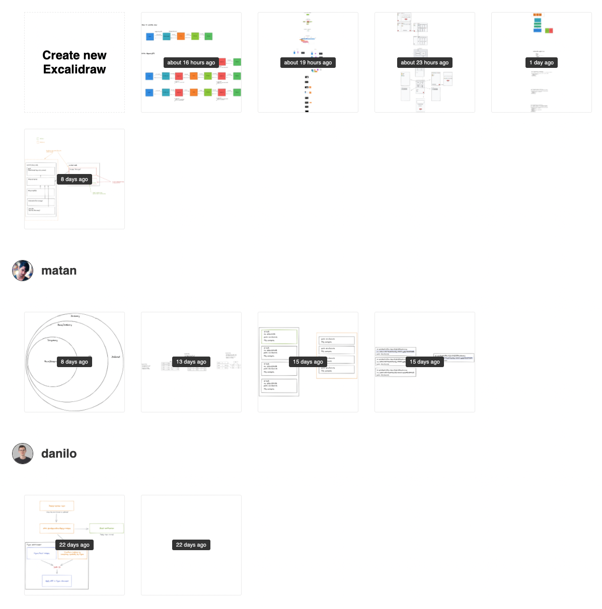

# excalidraw-firebase

> A persistent catalogue of your and/or company Excalidraws



## How to set up

1. Create a Firebase Project on the [Firebase Console](https://console.firebase.google.com/u/0/)
2. Copy the Firebase config to the `src/firebase.config.json` file:

```json
{
  "apiKey": "...",
  "authDomain": "...",
  "projectId": "...",
  "storageBucket": "...",
  "messagingSenderId": "...",
  "appId": "..."
}
```

3. Add **Google** as Authentication -> Sign In Method, in Firebase Console
4. Install the Firebase tools: `yarn add -g firebase-tools` and log in `firebase login`
5. Change the `firestore.rules` file to reflect your personal email or your company Google domain
6. (Optional) Go to Authentication -> Sign In Method and add a custom domain
7. Deploy it with `yarn deploy`
